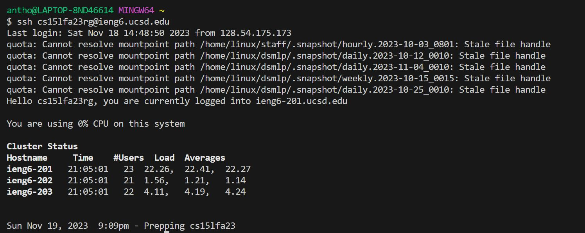
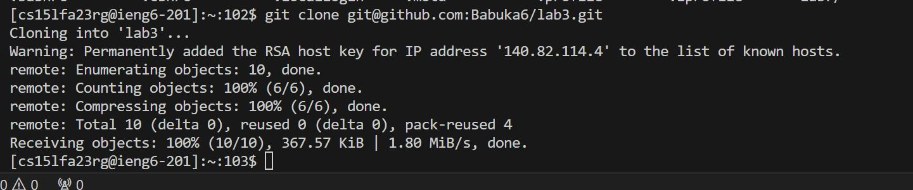
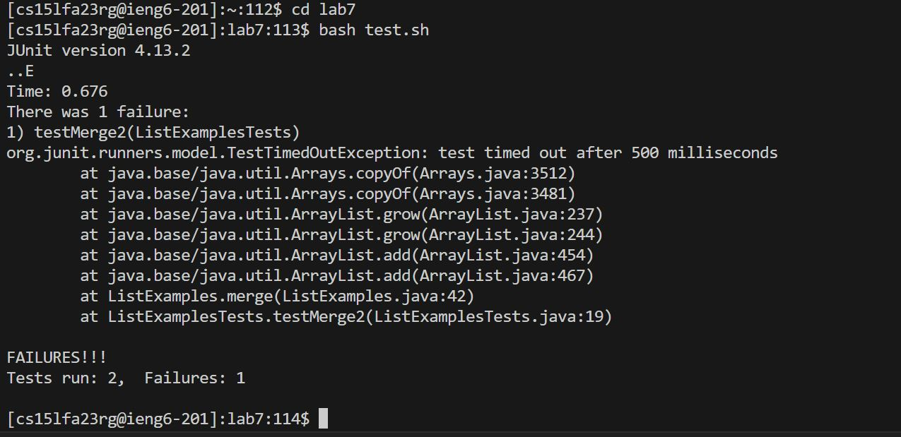
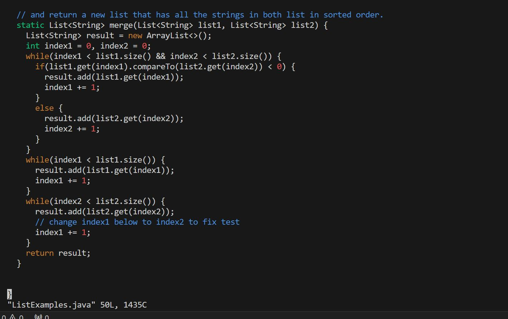
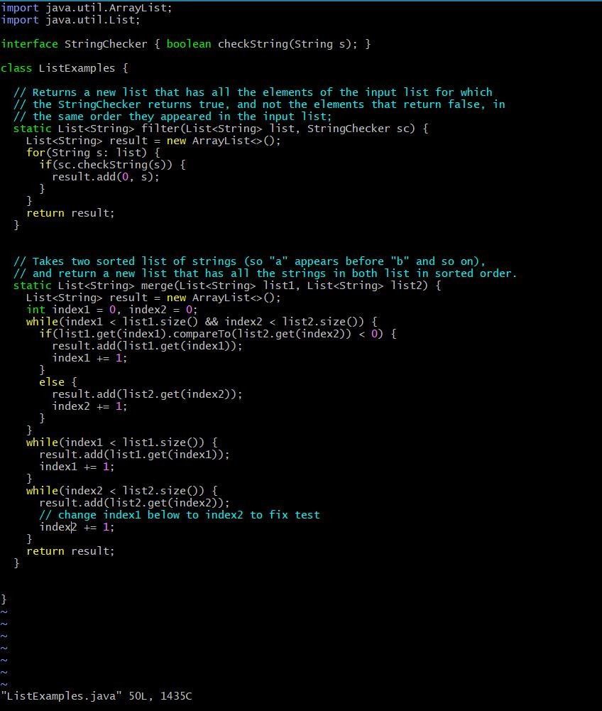
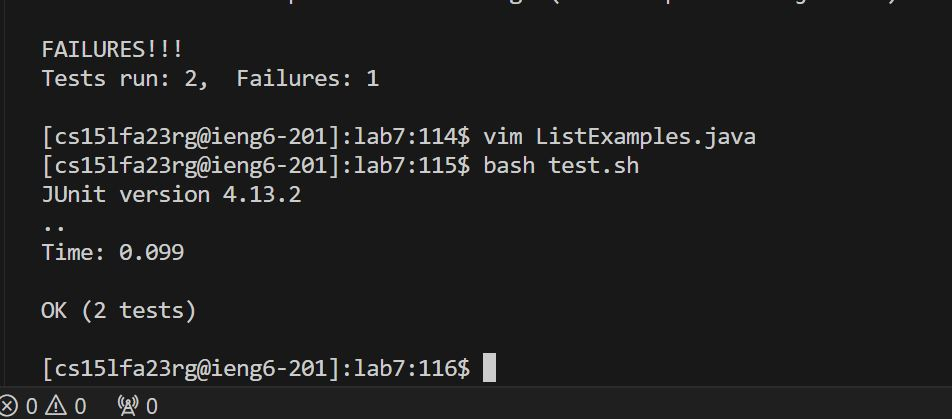
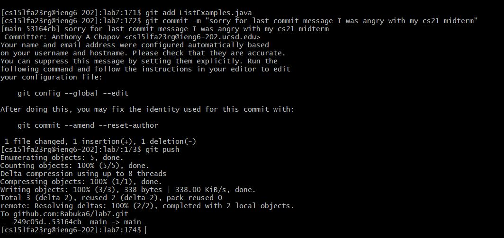

Lab 4. Deleted fork but kept terminal open from previous session. 

4. Step 4: 
 ```
ssh <space> <tab> <enter> ->  $ ssh cs15lfa23rg@ieng6.ucsd.edu <enter> to log in into the protected server. 
```
5. Step 5: 
```
git <space> clone <space> git@github.com:Babuka6/lab7.git <enter> cd lab7 <enter> to clone the directory's content and then change currect directory into lab7 where listexamples file is. 
 ```
6. Step 6:
```

bash test.sh <enter> to run the test files via script test.sh 
``` 

7. Step 7:
```

vim Li <tab> -> vim List -> vim ListE <tab> -> vim ListExamples -> vim ListExamples.java <enter> opens ListExamples with vim editor
```
Inside the vim editor when ListExamples.java is open: 
```

<k> 6 times. <l> 12 times. -> <i> to enter insertm mode. -> <backspace> then <2> to replace 1 with 2. Then <esc> to escape the insert mode. Then <:wq> to exit and save changes. -> closes vim.
```
8. Step 8:
```

<up><up> to find bash test.sh -> <enter> to run tests -> tests passed.
```
9. Step 9:
```

git add L <tab> -> git add ListExamples.java <enter> to put ListExamples's changes in staging area; git co <tab> -> git commit <enter> -> <esq> <:wq> permanently committs the changes and saves commit message. Finally, just type git push <enter> uploads local repository's content into the github (remote) repository.
```
 
















