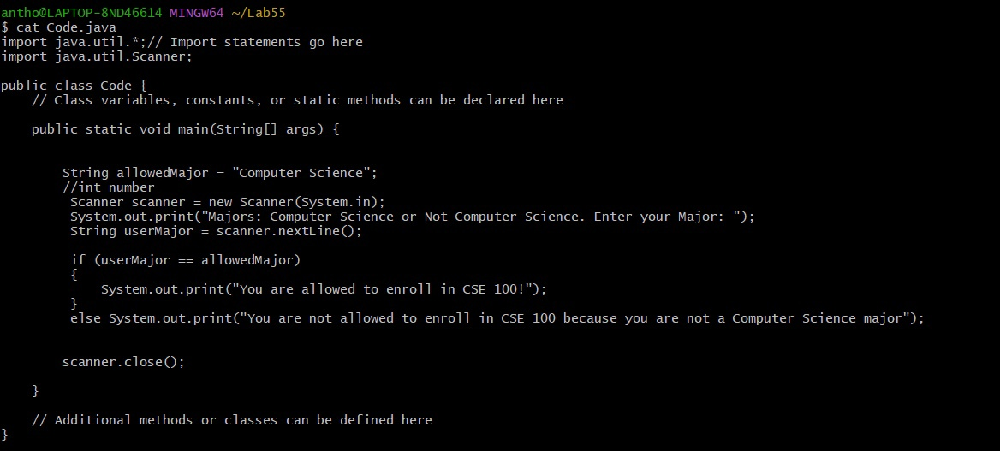
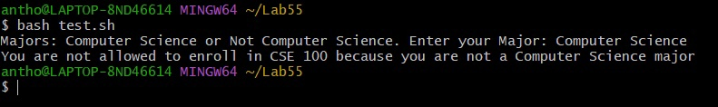
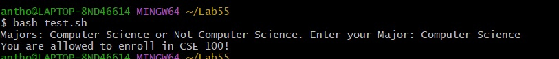
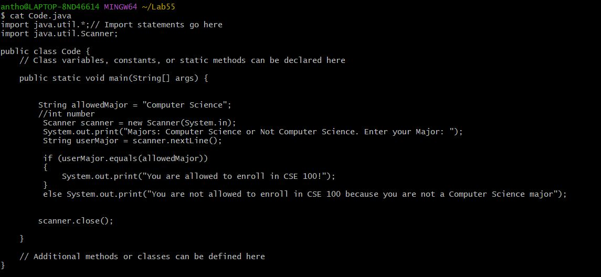
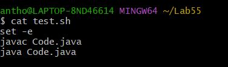

# Part 1, Debugging Scenario 

## Student: 
I am designing a function for CSE department's enrollment system. My function prompts student to verify if he/she is a Computer Science major. If so, they can enroll in CSE100. Else, they cant enroll in CSE 100. For some reason, when I type input "Computer Science major" and check if it is the same string as allowed major "Computer Science" -- it tells me that I cant enroll in CSE 100. I made sure that there is no typos and that I do ``` == ``` instead of ``` = ``` assigning operation in the if statement. Please help! 



## TA: 
I see that your code is mostly correct. However, you should review a use of ``` == ``` with objects. We know from the class that two strings have different adresses in the memory. What does it mean if we want to compare them? 

## Student: 
After reading java documentation on ```==```, I realized that it compares whether two strings are the same object. Even though ``` == ``` with string can sometimes work correctly, it can lead to unexpected behavior. After reading documentation on strings, I found a good method to compare the value placed in objects instead of comparing the objects themself. I will use ``` equals ``` method instead.



## File and Directory Structure:
Two files: ``` Code.java ``` that has the code to check and ``` test.sh ``` script that compiles and runs the Code.java. 


### Contents of the files: 
```Code.java```



```test.sh```



### Commands to trigger the bug(unexpected behavior):
```bash test.sh ```

### Fix of the bug (unexpected behavior): 
Replacing ``` == ``` that sometimes work with literals and sometimes not, use .equals() instead.  


# Part 2, Reflection
As I did not have experience with github and terminal before taking this class, I learned a lot. I learned how to use git terminal, visual studio code, a structure of files, how to work with github repositories. I also learned how to write scripts to simplify a lot of work when programming. I also learned a little bit of vim which I now use when I want to edit files within the terminal instead of spending time opening files mannualy by going in files in the "search" menu on Windows. After learning all this stuff, I now practice it by creating a simple website via github pages where I practice all commans I learned. 


