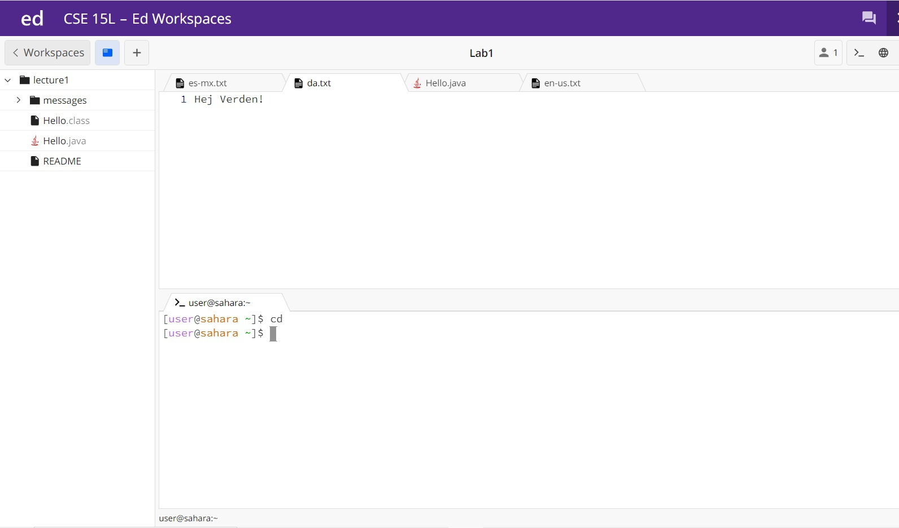
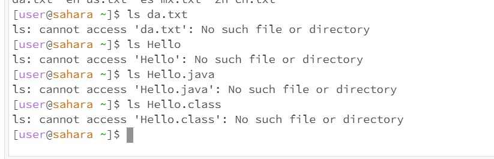
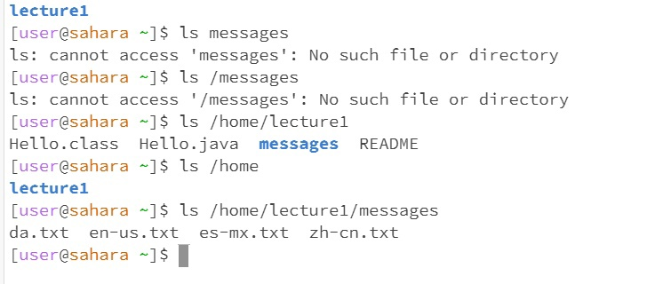
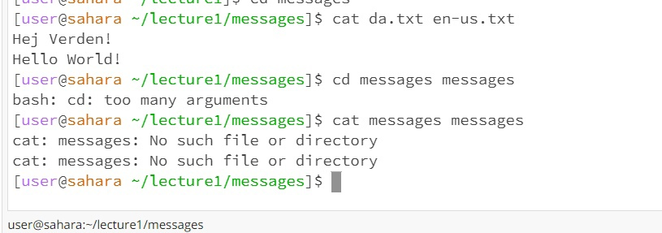

_Anthony Chapov, CSE15L, Lab Report #1 (cd, cat, ls use)_ 

## cd command block:

> **cd with no arguments**
  * a) 
  * b) wd: /home -> /home
  * c)no output -> no change in directory
  * d) It is not an error -- just no argument to change the directory or missing argument can be treated as current     
  directory and a redundant statement.

> **cd with files**
  * a) 
  * b)wd: /lecture1 -> /lecture1
  * c)bash: no such file or directory OR not a directory
  * d) cd does not work with files since it only works with directories. .txt and .java are files and terminal gives      error.

> **cd with directory**
  * a) 
  * Remark:
  * To do cd on directory (folder) we dont need to specify the entire path starting from C. just the name of directory   and terminal fills the path automatically
  * 
  * b)wd: /home -> /home/lecture1 
  * c)terminal shows new working directory 
  * d)no errors
---
## ls command block:

> **ls with no arguments**
  * a) 
  
  * a2) 
  * Remark: but it only list directories and files that 1 level below. So doing ls on home prints only lecture1 and not messages inside lecture1 cause its would be 
    level 2 while lecture1 is level 1 (where home is like level 0)
  * b)wd: /home/lecture1/messages
  * c)output is the text files in messages
  * d)no errors
  
> **ls with files**
 * a) 
 * b)wd: /home
 * c)ls with filers does not work cause file is the last point of the path. file cannot have another file otherwise it becomes a folder or directory I guess that is   
 * why. It does not work with files.
 * d)No such file or directory. Explained above why.
  
> **ls with directory**
 * a) 
 * Remark: So apparently for ls with argument I have to specify the whole path to file and not just name of directory like in case with cd where we dont need it
 * b)wd: /home 
 * c)prints every folder in the current directory -- does not print folders and files that are sub folders of a folder/file in a current category 
 * d)no errors
---  
## cat command block:

> **cat with no arguments**
 * a) 
 * b)wd: /home
 * c) Creates a infinite loop of taking input from keyboard or some other string value? 
 * d) Technically not at en error but bugs the terminal. To cancel the input and fix terminal I found solution on google — press ctrl + d
  
> **cat with files**
 * a) 
 * b)wd: home/lecture1/messages
 * c) Okay so cat works with files because it prints the information from files and also dont need the whole path. Cause it works with files and folders it cannot 
     print stuff from messages
     cause messages contaitns files it is not a file
 * d) No error
  
> **cat with directory**
 * a) 
 * b)wd: home/lecture1/messages
 * c) Does not work with messages or anything that is not a file like .txt 
 * d) No such file or directory. Probably the "no such file" is the only relevant part of the error since it works only with files?
