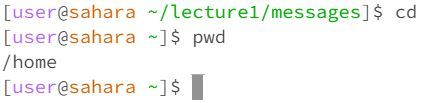
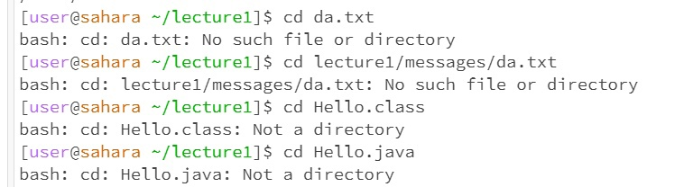
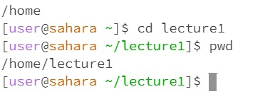
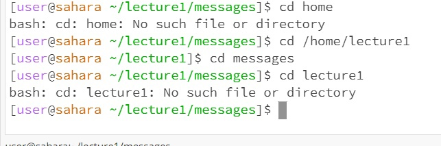
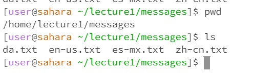
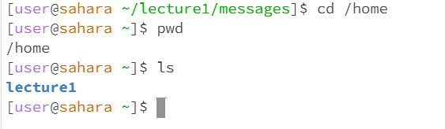
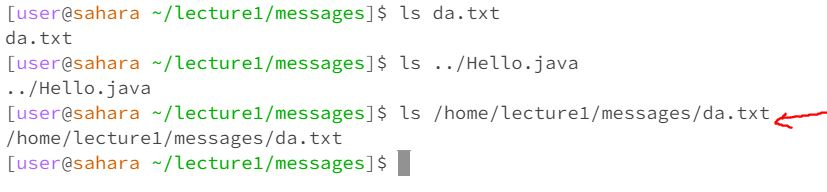
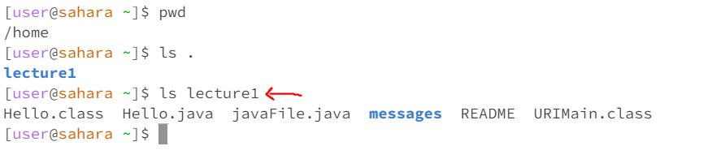
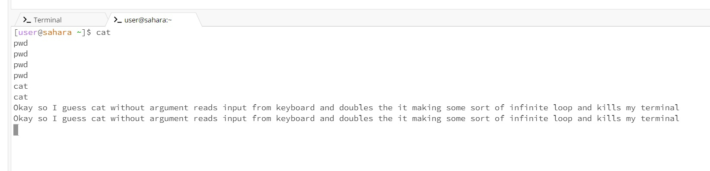
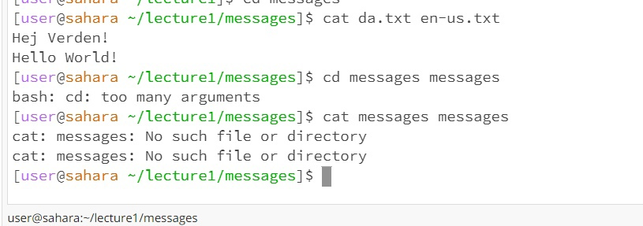

_Anthony Chapov, CSE15L, Lab Report #1 (cd, cat, ls use)_ 

## cd command block:

> **`cd` with no arguments** 
  * a) 
  * b) wd: /home/lecture1/messages
  * c)changes working directory to my home directory. /home 
  * d) It is not an error -- predefined behavior 

> **`cd` with files**
  * a) 
  * b)wd: /home/lecture1
  * c)bash: no such file or directory OR not a directory
  * d) cd does not work with files since it only works with directories. .txt and .java are files and terminal gives      error.

> **`cd` with directory**
  * a) 
  * 
  * b)wd: /home
  * c)terminal shows new working directory as long as path is correct. So say If I sit in /home and write cd lecture1 it will give new working directory /home/lecture1 because there is lecture1 in /home. But If I sit in /home/lecture1 and try to "cd home" -- it will give an error cause there is no "home" directory in /home/lecture1/ and I gave relative path. However, if I try to cd into /home from /home/lecture1/messages it will work because I provided absolute path. 
  * d)No errors in the first case. Second screenshot included just to show possible "error states" when path is !intentionally! incorrect. 
---
## ls command block:

> **`ls` with no arguments**
  * a) 
  
  * a2) 
  * Remark: but it only list directories and files that 1 level below. So doing ls on home prints only lecture1 and not messages inside lecture1 cause its would be 
    level 2 while lecture1 is level 1 (where home is like level 0)
  * b)wd: /home/lecture1/messages
  * c)output is the text files in messages
  * d)no errors
  
> **`ls` with files**
 * a) 
 * b)wd: /home/lecture1/messages
 * c)Since the given path can be though of as having just the file, this command would simply list that path/file ("this file containts only this file")
 * d)No errors as long as accessed from correct working directory.
  
> **`ls` with directory**
 * a) 
 * 
 * b)wd: /home 
 * c)prints every folder and file in the specified path -- does not print folders and files that are sub folders of a folder/file in a current category 
 * d)no errors
---  
## cat command block:

> **`cat` with no arguments**
 * a) 
 * b)wd: /home
 * c) Creates an infinite loop of taking input from keyboard or some other string value.
 * d) Technically not at en error but freezes the terminal. To cancel the input and fix terminal I found solution on google — press ctrl + d
  
> **`cat` with files**
 * a) 
 * b)wd: home/lecture1/messages
 * c) Okay so cat works with files because it prints the information from files and also dont need the whole path. Cause it works with files and folders it cannot 
     print stuff from messages
     cause messages contaitns files it is not a file
 * d) No error
  
> **`cat` with directory**
 * a) 
 * b)wd: home/lecture1
 * c) Does not work with messages or anything that is not a file like .txt -> just says that it is a directory
 * d) Somewhat an error. For directory as input it just prints that "it is a directory" which tehnically is correct and expected for directory as the input.  
