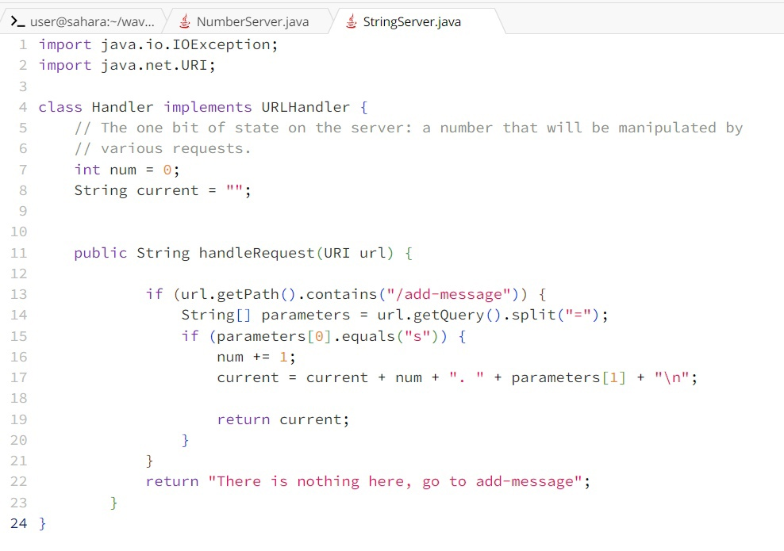
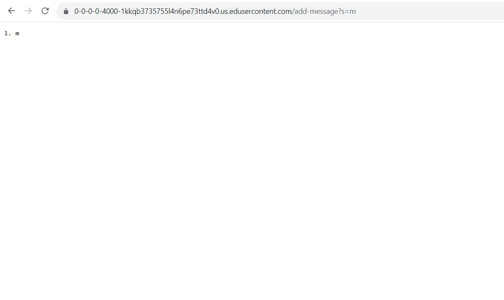
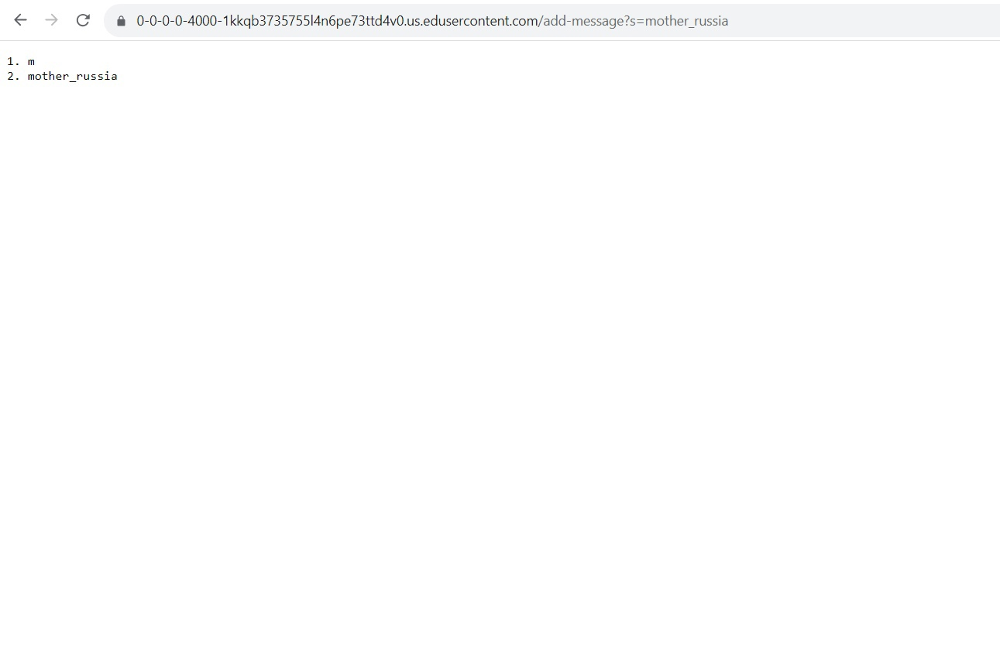
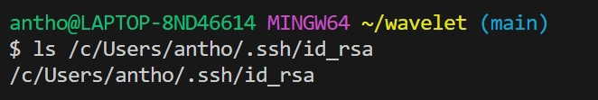
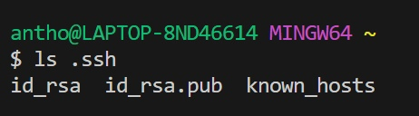
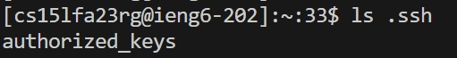
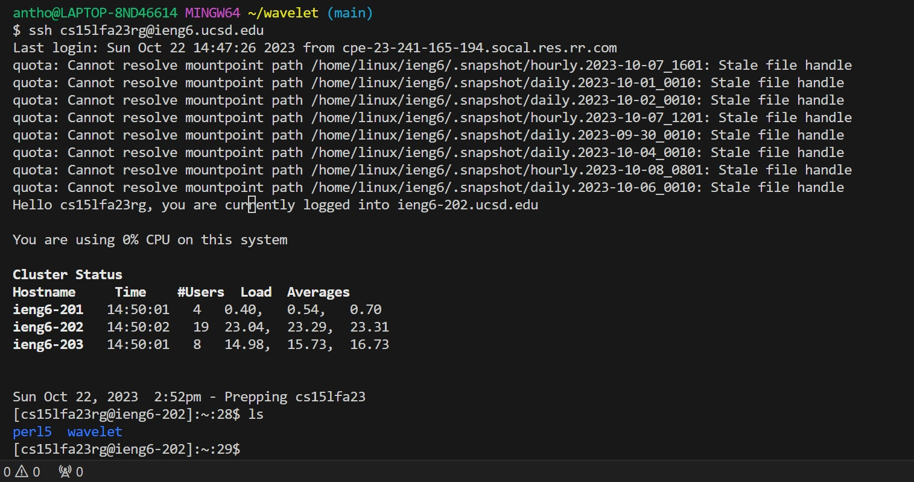

_Anthony Chapov, CSE15L, Lab Report #1_

Part 1:
Code For String Server :

A.
  1. Method: .handleRequest()     Argument: https://0-0-0-0-4000-1kkqb3735755l4n6pe73ttd4v0.us.edusercontent.com/add-message?s=m, return "m"
  2. Method: .getPath.containts() Argument: "/add-message"
  3. Method: .getQuerry.split()   Argument "="
  4. Method: .equals()            Argument "s"
  5. parameters[0] = "s"
  6. parameters[1] = "m"
  7. current = "m"
     
     
  
B.
  1. Method: .handleRequest()     Argument: https://0-0-0-0-4000-1kkqb3735755l4n6pe73ttd4v0.us.edusercontent.com/add-message?s=mother_russia, return "1. m \n 2. mother_russia"
  2. Method: .getPath.containts() Argument: "/add-message"
  3. Method: .getQuerry.split()   Argument "="
  4. Method: .equals()            Argument "s"
  5. parameters[0] = "s"
  6. parameters[1] = "mother_russia"
  7. current = "1. m + \n + 2. mother_russia"

     

Explanation: 
The only values that change are:
 1. handleRequest's argument since overall url changes when we change m to mother russia
 2. parameters[1] changes because url adress changes ("m" and "mother russia").
 3. current is updated to include the previous values of current ( all parameter[1] so far), new index of new parameter[1],
    and new just added value of parameter[1], and new line to keep it separetly from previous paramater[1] values.
4. num is just dummy value to keep track of position of parameter[1] in the output
   
Values that are not changed:
 1. parameter[0] = s and getPath.containts(/add-message) are preserved because we only change value of parameter[1]. If we change those values we change behavior of the method: if false and if false will result in other-than-we-want output. ("There is nothing here -> go to add-message")
 2. split(=) argument is preserved since its the way we differentiate indexes in parameters[1...n] and is part of standart url path. 

 

 

 Part 2: 
 
 
 

 

 
 

 Part 3. 
 I learned that we can communicate directly with the remote server via the terminal. It was also interesting to learn that we can run server on the same remote UCSD computer, which can be thought of as a server on the server (since, in my understanding, ucsd computer is a server itself). It was also fun to learn more about the encryption concept that underlines use of two private and public keys: one for chiper and the other one for decipher.  
 

