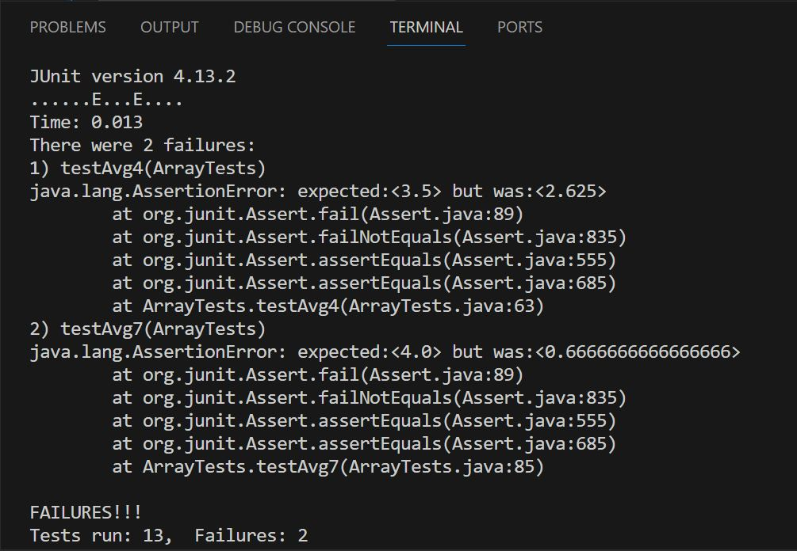

# CSE15L -- Anthony Chapov -- Lab 3 -- 1. Testing and Debugging 2. Researching command's variations. 

# Part 1:

## A failure-inducing input for the buggy program, as a JUnit test and any associated code (write it as a code block in Markdown):

### First input: 
Note that we inputp1 containts multiple copies of lowest value. We want to lowest value from the list, but what if there are few copies of same lowest value?
```

@Test
  public void testAvg4() {
    double[] input1 = {0.4,4.1,2.9,3.5,0.4}; //bug 
    assertEquals(3.5, ArrayExamples.averageWithoutLowest(input1),0.05);

  }
```

### Second input:
Note that here we have just 1 single element that is not copy of minimum value. So the average must consider just 4 because 2 and any of its copies must be excluded. Right?

```

@Test
  public void testAvg7() {
    double[] input1 = {2,2,2,2,2,4,2}; //including multiple copies of min el.
    assertEquals(4, ArrayExamples.averageWithoutLowest(input1),0.05);

}  
```

## An input that doesn’t induce a failure, as a JUnit test and any associated code (write it as a code block in Markdown)
 
### First input:
Note: runs good because no duplicates. 

```
@Test
  public void testAvg5() {
    double[] input1 = {1,4.5,-2,3.4,0}; //including zero and negative value
    assertEquals(2.225, ArrayExamples.averageWithoutLowest(input1),0.05);
    
  }
```

### Second input:
Note: runs good because 2 is minimum value. Thus, any of its copies excluded from calculation. Excluding all 2's leaves us with {} list. In this case sum is not incremented and is still 0. Diving 0 by array's size (other than 0 of course) works correctly and produces 0. It is because for the calculation excluding minimum, we exclude all elements and thus take average of "nothing": zero as answer make sense. 

```
@Test
  public void testAvg6() {
    double[] input1 = {2,2,2}; 
    assertEquals(0, ArrayExamples.averageWithoutLowest(input1),0.05);
   //excluding minimum in this case is excluding all copies of 
   //minimum ->size < 2 -> 0 
  }
```
## The symptom, as the output of running the tests (provide it as a screenshot of running JUnit with at least the two inputs above)


## The bug, as the before-and-after code change required to fix it (as two code blocks in Markdown)

### Original code: 

```
static double averageWithoutLowest(double[] arr) {
  if(arr.length < 2) { return 0.0; }
  double lowest = arr[0];
  for(double num: arr) {
  if(num < lowest) { lowest = num; }
  }
  double sum = 0;
  for(double num: arr) {
  if(num != lowest) { sum += num; }
  }
  return sum / (arr.length - 1);
  } 
```

### Beatiful, magnificient, superb code (fixed):

```
static double averageWithoutLowest(double[] arr) {
    if(arr.length < 2) { return 0.0; }
    double lowest = arr[0];
    for(double num: arr) {
      if(num < lowest) { lowest = num; }
    }
    double sum = 0;
    int duplicatesOfMin = 0;

    for(double num: arr) {
      if(num != lowest) { sum += num; }
      else if (num == lowest) {duplicatesOfMin++; }
    }
    if (arr.length != duplicatesOfMin)
    return sum / (arr.length - duplicatesOfMin);
    else
    {
      return 0;
    }
  }

Time: 0.012

OK (13 tests)
```

## Briefly describe why the fix addresses the issue:
As we can see in the failure-producing input, whenever we have more than 1 copies of minimim value that we want to exclude, the original code assumes there is only 1 copy of minimum value and substracts just 1 from arr.length in the final sum/(arr.length - 1) calculation. We can see an example where 2,2,2,2,2,4,2 list must exclude all 2's and just leave us with 4. The wrong code correctly calculates the sum, since as long as num is not lowest it adds num. Basically it adds 4 because 4 is not equal to 2. It does not include 2's copies because 2 equals 2. BUT! As I stated above, it assumes that there is only 1 copy of 2, so it will exclude just 1 element when calculating the sum/ arr.length - 1 (mean). It is not what we want. We know that if we have multiple copies of 2, we want to exclude all of them from our calculation. So here is what I did. I count number of times 2 (lowest value) appears in the list, and substract amount of these copies when calculate the mean without lowest. So I get rid of number of 2's and then 4/1 = 4 is correct. Otherwise, it for arr.length-1 version, it calculates 4/size of array - 1 which is 4/6 = 0.67. 

Also I guarded the chance of having zero in the denamitor. I check if arr.length == duplicatesOfMin, so that we dont have situation X/0. 
If arr.length is equal to duplicatesOfMin, then its just case of something like {2,2,2}. It makes sense to set the avarage of this to zero because we exclude all two's from all calcuations as they all are our min value. So we get mean{} = 0. 

# Part 2:
# grep command search 
Using ChatGPT 3.5 and prompt "Give me useful and interesting ways to use grep command" 

## Example 1) Search Multiple Files: grep "pattern" chapter-*.txt
 
### a)Search for a pattern in multiple files in same directory:
grep "pattern" chapter-*.txt
```
antho@LAPTOP-8ND46614 MINGW64 ~/OneDrive/Documents/Github/docsearch/technical/911report (main)     
$ grep "knife" chapter-*.txt
chapter-13.3.txt:                considered by a reasonable person to be a 'menacing knife' and/or 
may be illegal
chapter-7.txt:                knife to prepare to use knives during the hijackings. The recruits learned to focus
```
### b)Search for a pattern in multiple files in multiple directories:
```
antho@LAPTOP-8ND46614 MINGW64 ~/OneDrive/Documents/Github/docsearch/technical (main)
$ grep "alcohol" biomed/*.txt  911report/*.txt
biomed/gb-2002-3-12-research0078.txt:        alcoholism is the loss of cerebral white matter [ 24].biomed/gb-2002-3-12-research0078.txt:        affects severity of physical dependence on alcohol only in
biomed/gb-2003-4-3-r20.txt:          alcohol (24:1) was added using 0.2 ml/ml Trizol. Samples
biomed/gb-2003-4-6-r37.txt:          ALDH1A1 ), and alcohol
biomed/gb-2003-4-6-r37.txt:        alcohol dehydrogenase 1B, enzymes that affect retinoic acid     
biomed/rr166.txt:          isopropyl alcohol. Isopropyl alcohol was removed by
911report/chapter-5.txt:                served alcohol. In late 1997, he applied for permission to 
complete his course work
911report/chapter-7.txt:                to Islamic law, were known to drink alcohol.
911report/chapter-7.txt:                Salem al Hazmi's father recounted that Salem- who had had problems with alcohol and
```
### c) Might be useful to go through all files at once and find specific pattern. It would be very useful for doing research or finding correlation between multiple reports. Say I want to study alcoholism from biological prospective as well as study alcohol-related crimes that are recorded in 911 calls.

## Example 2) Search for Email Addresses or URLs:

### a)Search for Email Addresses (I modified text files to see if this command works*)
```
$ grep -E '\b[A-Za-z0-9._%+-]+@[A-Za-z0-9.-]+\.[A-Z|a-z]{2,7}\b' 911report/*.txt
911report/chapter-1.txt:"WE HAVE SOME PLANES" firstname@gmail.com
911report/chapter-2.txt:            THE FOUNDATION OF THE NEW TERRORISM secondname@gmail.com

```
### b)Search for URL's
```
antho@LAPTOP-8ND46614 MINGW64 ~/OneDrive/Documents/Github/docsearch/technical (main)
$ grep -E 'https?://[^\s"]+' 911report/chapter-2.txt
            THE FOUNDATION OF THE NEW TERRORISM https://github.com/Babuka6/cse15l-lab-reports/edit/main/lab3.md
```
### c) Good If I want to find a emails in a research paper or in any sort of file data base without doing it mannualy. Same idea applies to URLs. If I want to find related papers and their links without going over the file mannualy.

## Example 3) Highlight the instances of string search 

### a)grep --color "pattern" file.txt

```
antho@LAPTOP-8ND46614 MINGW64 ~/OneDrive/Documents/Github/docsearch/technical (main)
$ grep --color "killer" 911report/chapter-*.txt
911report/chapter-2.txt:                sons. The killers were assumed to be rival Egyptians. The outcome left Bin Ladin
911report/chapter-2.txt:                1995 appears to have been a tipping point. The would-be killers, who came from the
911report/chapter-8.txt:                one point calling him a "major league killer." He concluded that "something bad was
```
This will highlight all "killer" instances as a string or substring to red. 

### b)Combining grep --color "pattern" file.txt with -w to search for only whole words instead of "pattern" also being a substring. Also we can change the color of highlight by exporting first statement (36 can be changed to 31,32,33,etc):

```
export GREP_COLORS='ms=01;36'  # Change highlighting to Cyan
antho@LAPTOP-8ND46614 MINGW64 ~/OneDrive/Documents/Github/docsearch/technical (main)
$ grep --color -w "kill" 911report/*.txt
911report/chapter-11.txt:                Trade Center bombing had been intended to kill a lot of people, not to achieve any
911report/chapter-11.txt:                not believe they fully understood just how many people al 
Qaeda might kill, and how
911report/chapter-11.txt:                proxies to try to capture or kill Bin Ladin and his lieutenants. As early as
911report/chapter-12.txt:            Terrorism is a tactic used by individuals and organizations to
```


